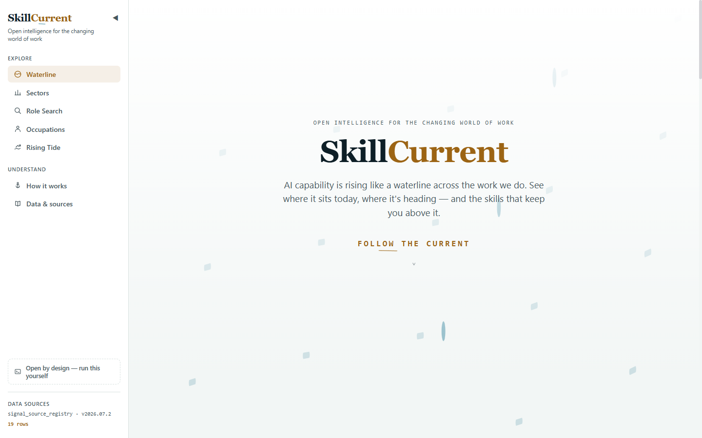
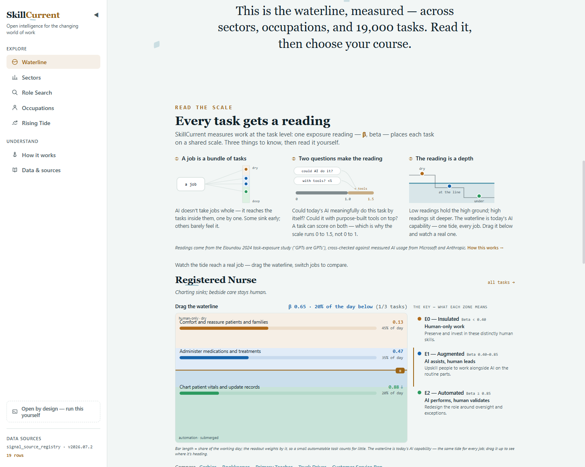
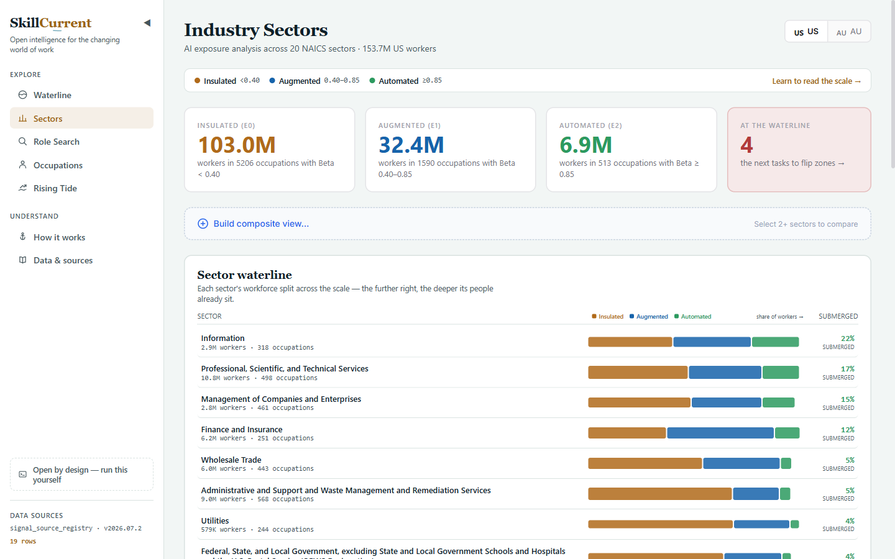

# SkillCurrent

*Open intelligence for the changing world of work.*

[](https://royster70.github.io/skillcurrent/)
[](https://github.com/royster70/skillcurrent/actions/workflows/ci.yml)
[](https://github.com/royster70/skillcurrent/actions/workflows/deploy-static.yml)
[](LICENSE)
[](DATA_LICENSE)

**[▶ Explore the live site →](https://royster70.github.io/skillcurrent/)** — the full dashboard runs in your browser, no install and no backend.

[](https://royster70.github.io/skillcurrent/)

## What SkillCurrent helps you understand

AI capability is rising across the work we do — not evenly, and not all at once. SkillCurrent is an open, evidence-based way to read where it sits **today**, where it's **heading**, and what to **do** about it — at the level of individual **tasks**, not whole jobs.

Every ordinary view answers three questions in plain language:

1. **Current AI exposure** — how much of this work today's AI could do.
2. **Direction of change** — whether AI usage of it is growing, steady, or newly appearing.
3. **Recommended response** — the durable skills to build and the roles they open.

It combines the O\*NET occupational taxonomy, theoretical exposure research (Eloundou 2024), empirical AI-applicability data (Microsoft, Anthropic), and government employment statistics (US and Australia) into workforce-planning intelligence — sitting between "will AI take my job?" sites and enterprise workforce analytics.

> **Plain or nautical?** The interface ships two vocabularies you can switch between from the sidebar. **Plain** (the default) uses ordinary terms. **Nautical** is the brand vocabulary — a rising *waterline*, the *tide*, your *bearings*, the *high ground* — for those who prefer the metaphor. The measurement jargon (β, the E-codes, drift velocity) always lives behind an "Explain this score" control.
>
> **Who's asking?** A second, orthogonal sidebar toggle picks an **audience lens** — *Individual* ("what do I learn?"), *Organisation* ("where do I invest / redesign?"), or *Education* ("how should the curriculum change?"). It reframes the same reading — the summary's headings, ordering and calls to action — without changing any of the numbers.

## How to read it

SkillCurrent measures where AI capability sits across the work we do, task by task, so you can see the reading and decide what to do.

[](https://royster70.github.io/skillcurrent/#read-the-scale)

Three things to know, then [read it yourself](https://royster70.github.io/skillcurrent/#read-the-scale):

1. **A job is a bundle of tasks.** AI doesn't take jobs whole — it reaches the tasks inside them, one by one. Some are affected early; others barely feel it. So the unit of measure is the *task*, not the job.
2. **Two questions make the reading.** Could today's AI meaningfully do this task by itself? Could it with purpose-built tools on top? A task can score on both — which is why the exposure reading, **β** (beta), runs 0 to 1.5, not 0 to 1:
   > `β = E1 + 0.5·E2` — direct AI exposure (E1) plus half-weighted tool-assisted exposure (E2). From the Eloundou et al. 2024 task-exposure study ("GPTs are GPTs"), cross-checked against measured AI usage from Microsoft and Anthropic.
3. **The reading is a level.** Low readings stay mostly human; high readings are within AI's reach today. The line is today's AI capability — the same for every job.

Each task's β sorts it into one of three **zones**:

| Zone | β range | What it means | What to do |
|------|---------|---------------|------------|
| 🟠 **Mostly human today** *(E0)* | β < 0.40 | Human-only work | Preserve and invest in these distinctly human skills |
| 🔵 **AI-assisted** *(E1)* | 0.40 – 0.85 | AI assists, human leads | Upskill people to work alongside AI on the routine parts |
| 🟢 **Highly automatable** *(E2)* | β ≥ 0.85 | AI can perform much of it | Redesign the role around oversight and exceptions |

*The top band reads capability, not deployment — AI can perform much of the task; whether it actually does depends on tools, controls, regulation and economics.*

**Why AI exposure keeps rising.** An *era* is a model generation — and they now arrive in months, not decades. Each new frontier model raises what AI can do, and work that sat safely out of reach becomes automatable. That's the change these pages measure — an order of magnitude faster than past technological shifts, and never backward. → [See which tasks are rising, era over era](https://royster70.github.io/skillcurrent/tide).

## Three ways in

- **"What's happening to my role?"** — search 66,500+ job titles, get every task placed on the exposure scale, a plain-English "what this means for you" summary, and named **skills to build** (the durable work to deepen, plus skills that bridge to less-exposed roles).
- **"How exposed is my industry?"** — scan US (NAICS) or Australian (ANZSIC) sectors, drill into priority roles, or blend several sectors into a composite workforce profile. Every result is badged with which **labour market** it reads (US or AU), and your choice persists.
- **"Where is it all heading?"** — watch which tasks are seeing the fastest growth in AI use, model generation over model generation.

## Explore it live

**[royster70.github.io/skillcurrent](https://royster70.github.io/skillcurrent/)** — the whole Tier 1 dashboard as a static build on GitHub Pages, no install and no backend. It reaches near-full parity with the Docker build; only the LLM-backed company lookup is dropped.

[](https://royster70.github.io/skillcurrent/sectors)

<sub>*Each sector's workforce split across the exposure scale — the further right, the deeper its people already sit. [See it live →](https://royster70.github.io/skillcurrent/sectors)*</sub>

## Evidence and limitations

SkillCurrent is honest about what it is and isn't:

- **Exposure is capability, not fate.** It measures what AI *could* reach, not what happens to jobs. The recommended moves are task-structure arithmetic (roles sharing a role's least-exposed activities), not career advice.
- **Evidence coverage is shown, not hidden.** Each occupation says how many independent signals cover it (predicted exposure from research, measured usage from Microsoft Copilot and Anthropic Claude) and a derived confidence word — never a fabricated score.
- **US and Australian readings are kept separate.** US readings use O\*NET tasks and BLS employment; Australian readings use the OSCA occupation backbone, ASC skills, and ABS employment, on a task-coverage basis. They are never blended, and every result view says which market it's from.
- **Full methodology and non-claims** are on the site's [How it works](https://royster70.github.io/skillcurrent/methodology) page, and per-source licences in [docs/data-sources.md](docs/data-sources.md).

## Run it locally

Three ways to run this, depending on how much you want to touch:

### 1. Docker (fastest — recommended)

Builds the backend, frontend, and a pgvector Postgres, and restores the committed [seed dataset](docs/SEED_DATASET.md) (43 tables, ~313k rows, incl. the genesis release snapshot) automatically on first boot — no data downloads required.

```bash
git clone https://github.com/royster70/skillcurrent.git
cd skillcurrent
docker compose up
```

- Frontend: http://localhost:3000
- API + docs: http://localhost:8000/docs

### 2. Native setup (for backend/frontend development)

See **[CONTRIBUTING.md](CONTRIBUTING.md)** for the full dev setup (Python 3.12, Node 20+, pgvector Postgres, pre-commit hooks). Once your `.env` and database are set up:

```bash
cd src/backend
alembic upgrade head
python -m scripts.doctor           # preflight check — reports what's missing
python -m scripts.restore_seed     # loads the same seed dataset the Docker image uses
python -m uvicorn app.main:app --reload --port 8000

# separate terminal
cd src/frontend
npm install && npm run dev
```

Prefer the full, real dataset instead of the seed? See [docs/INGESTION_RUNBOOK.md](docs/INGESTION_RUNBOOK.md) — downloads and ingests every public source from scratch (~602k rows, takes longer, no API keys needed either).

### Static mirror (no backend, no database)

The whole Tier 1 dashboard also runs as a **static site** — a visitor loads it in a browser with no server. It's deployed to GitHub Pages by `.github/workflows/deploy-static.yml`. To build it locally:

```bash
cd src/backend && python -m scripts.restore_seed && python -m scripts.build_static_site
cd ../frontend && VITE_DEPLOYMENT_MODE=cdn npm run build && npm run preview
```

See **[docs/STATIC_SITE.md](docs/STATIC_SITE.md)** for how it works.

## Contribute

- **Contributors** — see [CONTRIBUTING.md](CONTRIBUTING.md) for the dev setup and the quality gate (black + ruff + mypy `--strict`, pytest, vitest, Playwright).
- **Adding a data source** — every external source is registered in `signal_source_registry` with a licence and a `redistribution_ok` flag; see [docs/data-sources.md](docs/data-sources.md) for the classification rules and [CONTRIBUTING.md](CONTRIBUTING.md#data-licensing-matters-for-any-new-data-source) for what's required before a source can ship in the seed or a published export.
- **Researchers / citers** — the data compilation is CC BY 4.0; see [Licence](#licence) and [docs/data-sources.md](docs/data-sources.md) for per-source attribution.

## Architecture and API reference

**Two-tier design:**
- **Tier 1 — Industry Intelligence** (public data, no auth): occupation-level AI exposure analysis, drift tracking, industry profiles, and the AU-native occupation layer. Fully built.
- **Tier 2 — Organisational Overlay** (requires HRIS upload): maps a client workforce to Tier 1 intelligence with privacy controls. Not yet built.

The **Tier 1 API (~26 public endpoints)** is a read-only, no-auth REST API. The full catalogue lives in **[docs/API.md](docs/API.md)**; the always-current spec is the OpenAPI docs at http://localhost:8000/docs.

### Dashboard pages

Built with React 18, React Router, and Recharts. On narrow screens the sidebar becomes a top bar + drawer; on wide screens it's a collapsible rail.

| Page | Route | What's there |
|------|-------|--------------|
| Overview (landing) | `/` | The narrative explainer: the three headline concepts, the interactive "Read the scale" primer + worked example, and the rising-exposure era chart |
| Sectors | `/sectors` | Worker-count metric cards, zone split, sector waterline; composite-view builder; US/AU market selector; company type-ahead over ~1,978 ASX companies with AI classification (full build only) |
| Composite Sector | `/sectors/composite` | Multi-sector blended analysis: employment-weighted metric cards, unified occupation table with multi-sector badges, auto-generated narrative summary |
| Sector Detail | `/sectors/:code` | Narrative summary, score cards with percentile context, priority-roles ranking with risk badges; role rows open the occupation reading (AU rows with an OSCA match open the Australian panel) |
| Occupations | `/occupations` | Filter-as-you-type search over the SOC hierarchy, detail panel with the "what this means" summary, task waterline, bearings, **skills to build**, evidence-coverage badge, and GDPval panel |
| AI Trends | `/tide` | Task drift over model eras — classification split, usage vs velocity, at-the-line alerts, growing/steady lists (`/drift` redirects here) |
| Role Search | `/search` | Text (`pg_trgm` fuzzy) and semantic (sentence-transformers + pgvector) modes, optional job-description input, results with zone badges and score pills |

Plus three explainer pages: **How it works** (`/methodology`), **Data & sources** (`/sources`), and **Run this yourself** (`/run`). Frontend dev server: http://localhost:5173.

Any occupation or sector can also be exported as a **one-page brief** — a chrome-free print/PDF view at `/brief/occupation/:soc` and `/brief/sector/:code`, rendered in the reader's active audience lens (Individual / Organisation / Education) and language mode.

### Data loaded (~618,516 rows across ~43 tables)

| Dataset | Rows | What it provides |
|---------|------|-----------------|
| O\*NET 28.1 | 346,440 | 1,016 occupations (923 in hierarchy after filtering 93 residual/military), 19k tasks, 65k titles, 2k DWAs |
| Eloundou 2024 | 18,460 | 923 occupation + 17,537 DWA-level exposure scores |
| Microsoft "Working with AI" | 34,396 | Empirical Copilot applicability (785 SOCs, 332 IWAs) |
| AEI (Anthropic) | 35,730 | Empirical Claude usage + 4-era temporal snapshots |
| BLS OEWS 2024 | 8,573 | US employment by occupation × NAICS sector |
| ABS/JSA 2025 | 2,743 | AU employment by occupation × ANZSIC division (FR-8.9) |
| AU-native task layer (OSCA + ASC) | 63,157 | Australian occupation backbone (OSCA 2024) + skills classification (ASC v3.0): OSCA occupations/tasks, ASC specialist tasks, the semantic DWA↔ASC bridge, and the unified AU task + exposure layer (FR-9.x) |
| ABS Census 2021 + subdivisions | 1,391 | AU industry × occupation cross-tabs for company/sector classification (FR-8.9) |
| Derived products | 15,794 | Drift metrics (4,605) + industry profiles (9,025 US+AU) + crosswalk (21) + ANZSCO concordance (491) + AU profiles (1,090 of 9,025) |
| ASX company data | 1,978 | ASX listed companies with GICS→ANZSIC→NAICS sector mapping (FR-8.5 company lookup) |
| Title embeddings | 66,512 | Layer 2 semantic search (all-MiniLM-L6-v2, pgvector HNSW) |
| OpenAI GDPval | 10,673 | 220 real-world knowledge tasks + 10,453 rubric items across 44 occupations (FR-8.7) |
| Epoch AI ECI (GPTVal) | 464 | Longitudinal model-capability benchmarks — the waterline-velocity signal (FR-8.7 P0a) |
| Snapshot layer | 15,514 | Append-only history of derived verdicts — genesis 2026-Q3 release (ADR-012) |
| JSA Gen AI (AU) | 357 | Jobs and Skills Australia augmentation/automation — first AU-native exposure signal (FR-9.x) |

*Full per-table breakdown: [CLAUDE.md](CLAUDE.md) "Data Load Status" and [docs/DATA_DICTIONARY.md](docs/DATA_DICTIONARY.md).*

### Tests

~413 tests passing (261 backend + 106 component + 46 E2E). Component tests via Vitest + @testing-library/react. E2E via Playwright across 6 suites (sectors, search-to-occupation, occupations, drift, composite, company-lookup). Most backend suites need the seeded DB (see `conftest.py`); CI runs the DB-free subset — see `.github/workflows/ci.yml`.

```powershell
cd src/backend
python -m pytest tests/ -v                    # 261 backend tests (needs the seeded DB)
python -m pytest tests/ --cov=app             # with coverage

cd src/frontend
npm run test                                  # 106 component tests (Vitest)
npm run test:e2e                              # 46 Playwright E2E tests
```

### Tech stack

- **Backend**: Python 3.12, FastAPI, PostgreSQL 16 + pgvector, SQLAlchemy 2.x, Alembic
- **Data/NLP**: pandas, scipy, sentence-transformers (all-MiniLM-L6-v2)
- **Frontend**: TypeScript, React 18, Vite, Recharts/D3
- **Dev**: black, ruff, mypy --strict, pytest, vitest, Playwright (E2E)
- **Deployment**: Docker Compose (pgvector Postgres + backend + nginx-served frontend)

### Key documentation

| Doc | Purpose |
|-----|---------|
| [docs/ARCHITECTURE.md](docs/ARCHITECTURE.md) | **Start here** — functional (data-funnel) + solution architecture, with the DWA-pivot crosswalk diagram |
| [docs/API.md](docs/API.md) | Tier 1 API endpoint catalogue |
| [docs/SETUP.md](docs/SETUP.md) | Development environment setup |
| [docs/INGESTION_RUNBOOK.md](docs/INGESTION_RUNBOOK.md) | Data loading procedure and verification |
| [docs/SEED_DATASET.md](docs/SEED_DATASET.md) | Committed seed dataset — clone and run without the full ingest pipeline |
| [docs/STATIC_SITE.md](docs/STATIC_SITE.md) | The no-database static build (P4) — architecture + how to build it |
| [docs/DATA_DICTIONARY.md](docs/DATA_DICTIONARY.md) | All database tables, columns, join paths |
| [docs/data-sources.md](docs/data-sources.md) | Data sources, licences & attribution |
| [ai_working/decisions/README.md](ai_working/decisions/README.md) | Architecture Decision Records (index) |
| [docs/domain-model.md](docs/domain-model.md) | Data contracts and invariants |
| [docs/PRD-v1.1.md](docs/PRD-v1.1.md) | Product requirements |

## Licence

SkillCurrent is dual-licensed — code and data are distinct:

- **Code** — [MIT](LICENSE).
- **Data compilation** — [CC BY 4.0](DATA_LICENSE). The derived datasets are
  redistributable because every upstream source is CC BY / MIT / public domain.
- **Attribution** — see [NOTICE](NOTICE) for required per-source credit, and
  [docs/data-sources.md](docs/data-sources.md) for the full source registry.

Citation-only sources (e.g. AIOE, GDPval-AA, OpenAI's GDPval leaderboard scores)
are used only as cited references — never bundled, exported, or served.
