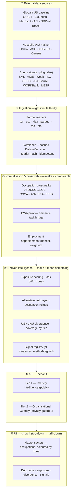
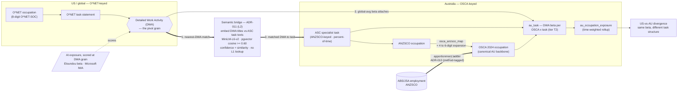

# Architecture — Workforce AI Impact Analysis Platform

How the platform is structured, at two altitudes:

- **[Functional architecture](#1-functional-architecture)** — what the system does and how the pieces relate, for anyone (stakeholders, analysts, new contributors).
- **[Solution architecture](#2-solution-architecture)** — how it's actually built, for engineers.

> **Core insight the architecture serves:** AI capability is a *rising waterline* across task landscapes. The platform measures where that waterline sits today, per task and occupation, employment-weighted — and tracks where it's heading. Everything below exists to turn a zoo of external research datasets into that single, comparable, honestly-caveated picture.

Status legend: ✅ built · 🧩 planned (see the roadmap in `CLAUDE.md`).

---

## 1. Functional architecture

The platform is a **six-layer pipeline** from raw external research to an interactive picture of AI's impact on work. Data flows up; each layer adds meaning and provenance.

### ① External data sources — three families
- **Global / US baseline** — the reference layer everything aligns to: O\*NET (occupation taxonomy, tasks, DWAs), Eloundou (theoretical exposure), Microsoft (applicability), Anthropic AEI (usage), OpenAI GDPval (capability), Epoch ECI (the capability waterline over model eras).
- **Australia (AU-native)** — OSCA (occupation backbone), ASC (Australian task/skill layer), ABS/JSA (employment), Census. The differentiator: *Australian* task structure, not US tasks re-weighted.
- **Bonus signals (pluggable)** 🧩 — a growing set of independent AI-impact measures (SML, AIOE, Webb, ILO, OECD, JSA-Gen-AI, WORKBank, METR). Each is one more lens on the same occupations; new ones keep emerging, so they onboard without schema change.

### ② Ingestion — get it in, faithfully
Every source is read by a format-appropriate loader, **versioned** (one immutable `DatasetVersion` per release), **hashed** (SHA-256 of the source bytes, so a silent upstream change is caught), and **idempotent** (safe to re-run). Nothing is trusted without provenance.

### ③ Normalisation & crosswalks — make it comparable
The heart of the platform. Different sources speak different classifications (US SOC, Australian ANZSCO/OSCA, international ISCO) at different granularities (6- vs 8-digit codes, occupation vs task vs work-activity). This layer reconciles them:
- **Occupation crosswalks** map codes across classifications (ANZSCO↔SOC, OSCA↔ANZSCO↔ISCO).
- **The DWA pivot** is the key move: AI exposure is scored at O\*NET *Detailed Work Activity* grain, and Australian ASC tasks were *built from* those same DWAs — so a semantic bridge re-attaches exposure to Australian task structure.
- **Employment apportionment** distributes headcount across occupations when a mapping is one-to-many, *weighted by the finest data held and never by invented proportions*.

### ④ Derived intelligence — make it mean something
Exposure zones (automated / augmented / insulated), task drift over model eras, the AU-native task layer with per-task exposure, the **US-vs-AU divergence** ("where Australian work diverges from the US template"), and a **coverage-by-tier honesty metric** (how much of the workforce is *measured* vs *modelled*). Signals stay in separate, method-tagged columns — **never silently blended**.

### ⑤ API — serve it
- **Tier 1 — Industry Intelligence** ✅: public data only, no privacy controls needed; the standalone benchmarking product.
- **Tier 2 — Organisational Overlay** 🧩: overlays a client's own workforce onto Tier 1 intelligence; every query goes through privacy views (N≥5 suppression, RBAC).
- **Tiers never mix.** Tier 2 (org data) never routes through Tier 1 endpoints; Tier 1 (public) never gets Tier 2 privacy views.

### ⑥ UI — show it
A **top-down → drill-down** experience: start at sectors/occupations coloured by exposure zone (the macro waterline), drill into an occupation's actual task decomposition ranked by exposure, then into a task's evidence (matched activity, confidence, US-vs-AU divergence, and every signal that covers it). A region toggle switches the whole view between the US baseline and the AU-native layer.

### Two structural axes that cut across all layers
- **Tier axis** — public Industry Intelligence (Tier 1) vs privacy-gated Organisational Overlay (Tier 2).
- **Region axis** — US baseline and AU-native today; UK/EU behind the same interface tomorrow. A "region" is `{occupation classification, ISCO concordance, optional native task layer, employment weights}`.

---

## 2. Solution architecture

### Technology by layer

| Layer | Technology |
|---|---|
| Data store | PostgreSQL 16 + **pgvector** (semantic search) + **pg_trgm** (fuzzy text) |
| Ingestion | Python 3.12 · pandas · format readers (openpyxl / pyarrow / pyreadr / pyreadstat) · SQLAlchemy 2.x · Alembic |
| Normalisation | sentence-transformers (`all-MiniLM-L6-v2`, 384-dim) · pgvector cosine · SQL apportionment |
| API | FastAPI · Pydantic · asyncpg |
| UI | TypeScript · React 18 · Recharts / D3 |
| Quality / CI | black · ruff (C90 ≤10) · mypy --strict · pytest · pre-commit |

### Component detail

**Ingestion (`app/services/*_ingestion.py` + `scripts/ingest_*.py`)** — one service + thin CLI per source, all on a shared pattern: read via the format-appropriate library, register a `DatasetVersion` row (`integrity_hash`, `source_url`, metadata), bulk-insert, log a `DatasetVersionDelta`. A source's reader is a *dataset-specific, ingest-time* dependency (see the `[ingest]` extra) — e.g. `pyreadr` reads the ASC `.rda` files **without an R runtime**.

**Normalisation & crosswalk engine** — the derived tables that make sources comparable:
- *Occupation crosswalks* — `anzsco_soc_concordance` (semantic ANZSCO→SOC), `osca_anzsco_map` / `osca_isco_map` (official ABS correspondences), `industry_crosswalk` (NAICS↔ANZSIC).
- *DWA pivot* (`app/services/dwa_asc_bridge.py`) — embeds O\*NET DWA titles + distinct ASC task texts, `LATERAL` top-k nearest-neighbour match at a cosine floor; **confidence = cosine**, no fabricated lookup (ADR-011). ~99.9% task coverage, matches crushed near 1.0 because ASC tasks are reworded DWAs.
- *Employment apportionment* (`app/services/osca_apportionment.py`) — the ADR-010 ladder: A0 double-count guard (prefer 6-digit detail) → A1 exact link → A3 employment-weighted / equal split. Reconciles **exactly** to the de-duplicated employment base; every row `link_method`-tagged (`full` = measured vs `apportioned_*` = modelled).

#### The DWA pivot — the main crosswalk chain

AI exposure is scored at **O\*NET DWA** grain. Australian ASC tasks were *built from* those DWAs, so a semantic bridge re-attaches exposure to Australian task structure, which then rolls up through ANZSCO→OSCA to Australian occupations. Employment (apportioned) weights it, and computing the US side the *same way* yields the divergence.

**Reading it:** the heavy arrows (1→2→3) are the pivot itself — a DWA finds its nearest Australian task (the bridge), which places exposure onto `au_task`. Everything measured this way is tier **T2** (semantic); there is no L1 code-lookup rung because ASC publishes no source-DWA column (the Phase B0 finding). The occupation-level crosswalks (OSCA↔ANZSCO↔ISCO↔SOC) sit *underneath* this — they carry occupation-level exposure and the employment weights, independent of whether task-level detail exists.

**Derived intelligence** — `task_drift_metrics` (velocity via linregress over AEI eras), `au_task` + `au_occupation_exposure` (DWA exposure attached to AU tasks, rolled up), `us_task_beta`/`divergence` (US and AU computed the *same way* so only task structure differs), coverage-by-tier metrics, and the 🧩 `signal_source_registry` + long-format `exposure_signal` table (any O\*NET/ISCO/DWA-keyed measure onboards as method-tagged rows).

**API (`app/api/v1/`)** — versioned FastAPI routers; endpoints branch on a `region` query param; Tier 2 endpoints 🧩 read only through `manager_team_view` / `executive_dashboard_view`. Timing middleware stamps `X-Request-Duration-Ms` + `X-Request-ID` on every response.

**UI (`src/frontend/`)** — React pages composing reusable panels (TaskMatrix, RegionSelector, sector/occupation views); a redesign 🧩 is planned to make the top-down→drill-down spine first-class across US + AU.

### Cross-cutting concerns
- **Provenance / lineage** — every derived record carries NOT NULL references to the source versions that produced it (ADR-002); `@tracked_transformation` writes a `transformation_log` row per compute step (ADR-001). Data invariants are pytest tests, not comments.
- **Observability** — `api_request_log`, `/admin/metrics` (P50/P95/max per path), `/admin/slow-queries` (`pg_stat_statements`), correlation IDs (ADR-007).
- **Governance & honesty** — separate-columns + method-tagging (measured never blended with modelled); employment-weighted coverage as a first-class metric; Tier 2 privacy (N≥5, RBAC); a per-source `licence` + `redistribution_ok` registry gating published outputs (for the open-source pivot).
- **Quality gate** — pre-commit runs black + ruff (complexity ≤10) + mypy --strict on every commit; CI runs migrations + tests against a seed.

### Load-bearing architectural decisions (see `ai_working/decisions/`)
| ADR | Decision |
|---|---|
| 001 / 002 | Lineage catalogue + reference-dataset versioning + integrity hashing |
| 007 | Performance instrumentation & correlation |
| 010 | ANZSCO→OSCA employment apportionment (mirror ABS convention; apportion by held counts; no invented proportions) |
| 011 | AU task exposure via a **DWA-pivot decision ladder** (semantic bridge is the live measured rung; availability ≠ confidence; headline uses measured tiers only) |

### Runtime & the three "run paths"
Postgres runs in Docker (`pgvector/pgvector:pg16`); backend and frontend are dev servers. A fresh environment reaches "running" by one of three paths, each with its own (layered) prereqs: **seed restore** (fastest — core deps only), **acquire + pipeline** (full/live — adds the `[ingest]`/`[ml]` deps + source acquisition), or **code-only** (contribute — `[dev]` only). See `docs/REBUILD_RUNBOOK.md`.

### Extensibility — how new things plug in
- **New dataset** → a source-registry entry + one ingest script on the shared pattern; its reader joins the `[ingest]` extra.
- **New signal** 🧩 → a row in `signal_source_registry` + rows in `exposure_signal`, resolved to existing keys via the crosswalks — no schema change.
- **New region** 🧩 → implement the `region` interface (classification + ISCO concordance + optional native task layer + employment weights); US and AU are the first two instances.

---

## See also
- `CLAUDE.md` — data model invariants, data-load status, build dependency chain (roadmap).
- `docs/domain-model.md` — data contracts & invariants in depth.
- `docs/DATA_DICTIONARY.md` — every table & column.
- `docs/INGESTION_RUNBOOK.md` / `docs/REBUILD_RUNBOOK.md` — how to build the data from scratch.
- `ai_working/decisions/` — the ADRs behind the decisions above.
